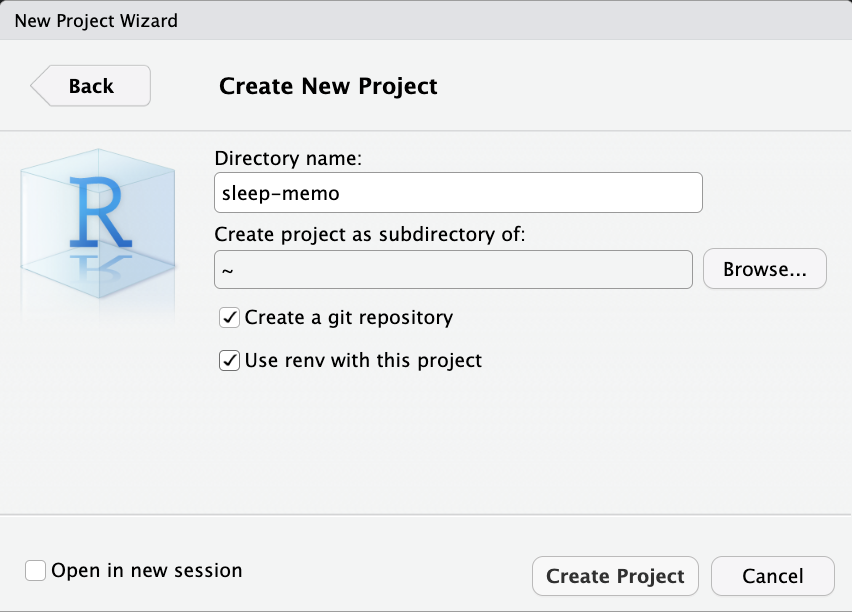
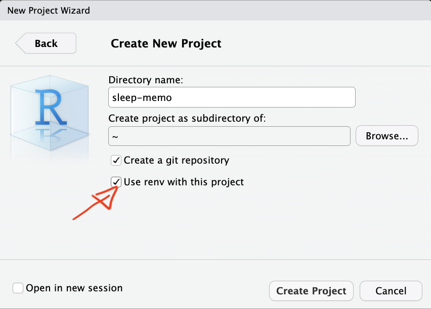
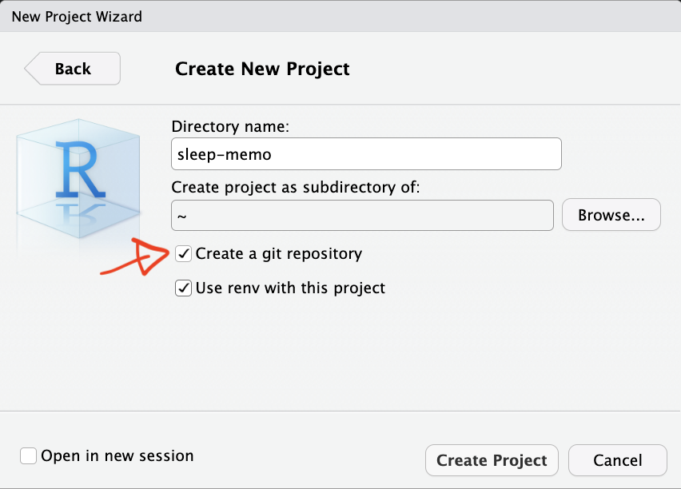

```{r}
#| include: false
#| message: false
#| warning: false
#| eval: true

pkg <- c("ggplot2", "patchwork")
sapply(pkg, require, character.only = TRUE)

my_cols <- c("#ff7eb6", "#5caebb", "#F8A31B", "#1c242c", "#9ca3af")

theme_clean <- function(base_size = 14) {
  theme_classic(base_size = base_size) +
    theme(
      axis.line         = element_line(colour = "black", linewidth = 1),
      axis.ticks        = element_blank(),
      axis.ticks.length = grid::unit(10, "pt"),
      axis.text         = element_blank(),
      axis.text.y       = element_blank(),
      axis.text.x       = element_blank(),
      legend.title      = element_text(size = base_size),
      legend.text       = element_text(size = base_size),
      legend.key.size   = grid::unit(1.2, "lines")
    )
}

set.seed(0526)
```

## About me :)

::: nonincremental
-   **Post-doctoral researcher**, University of Padova.
-   **Research:** Bayesian hypothesis testing, computational modeling of cognitive and learning processes.
-   **Passion:** Soccer and Reproducible science, driven by early struggles with messy datasets and a belief in transparent research!
:::

::: notes
That’s why I’m here today: to talk about reproducible science as a concrete way to improve the quality and transparency of our research.
:::

## Our job is hard

<br/>

::::: columns
::: {.column .nonincremental width="50%"}
-   Running experiments

-   Analyzing data

-   Managing trainees

-   Writing papers

-   Responding to reviewers\
:::

::: {.column width="50%"}
{width="489"}
:::
:::::

::: notes
It’s a lot. It’s easy to feel overwhelmed. And in that chaos, good practices often fall by the wayside. It’s tempting to write quick scripts, save datasets with unclear names, copy and paste plots into Word, and move on. But here's the thing: all of those shortcuts come at a cost.
:::

## Reproducibility helps!

::::: columns
::: {.column width="40%"}
<br/>


:::

::: {.column .nonincremental width="60%"}
<br/>

-   **Organizes** your workflow.

-   **Saves time** by documenting steps.

-   **Builds trust** in your findings.

-   Enables others to **reproduce** and **extend** your work.
:::
:::::

::: notes
I want to suggest that reproducibility is not an extra task. It’s not a burden we add on top of everything else. It’s a way of working that can replace the mess with a clear system. It’s an investment in your future self.
:::

# What is reproducible science? {background-color="#222b32"}

------------------------------------------------------------------------

Reproducibility can be considered as the most fundamental pre-requisite of replication in science.

> "...obtaining consistent results using the same input data, computational steps, methods, and code, and conditions of analysis." @repro2019

Meaning that someone else, or even you, in the future, can **reproduce** your **results** from your **materials**: your data, your code, your documentation.

::: notes
The experimental design, data and methodologies of analysis are all fixed. A reproducible research paper should provide enough information to obtain the results originally reported, starting from the same raw data. Raw data are data in a form as close as possible to what was generated by the original experimental source.
:::

## Keys to reproducible science

::: nonincremental
-   **Data**: organize, document, and share your datasets in ways that are usable by others and understandable by you (even years later).
-   **Code**: write analysis scripts that are clean, transparent, and reusable.
-   **Literate programming**: combine code and text in the same document, so your reports are dynamic and replicable.
-   **Version Control and Sharing**: track changes, collaborate, and make your work openly available using tools like GitHub and OSF (and/or Zenodo).
:::

::: notes
We need to organize, document, and share our data so it’s clear to others. Our analysis code should be clean, transparent, and reusable. By combining code and text in the same document, we make our work dynamic and understandable. And with version control tools like Git, we can track changes, collaborate, and share our work openly.
:::

## So... Is reproducible science even harder?

```{r, fig.align='center'}
x <- runif(1e2, 0, 10)
df <- data.frame(x = x, y = 2^x)
ggplot(data = df, aes(x = x, y = y))+
  geom_smooth(color = my_cols[2], size =2)+
  theme_clean(base_size = 20)+
  ylab("knowledge")+xlab("time")
```

::: notes
Learning takes effort. It can feel slow and confusing. But once you’ve learned these tools, your workflow becomes smoother.
:::

## Outline {background-color="#222b32"}

<br/>

### 1. Data

### 2. Code

### 3. R projects

### 4. Literate Programming

### 5. Version Control

::: notes
In the sections that follow, we’ll explore how to: • Document and structure your data, • Write readable, testable code, • Use functional programming principles to simplify your workflow, • Organize your projects in a way that’s portable and consistent, • And write scientific documents that are both human-readable and machine-executable.
:::

# Data {background-color="#222b32"}

::: notes
If your data is messy, undocumented, or inaccessible, it doesn’t matter how brilliant your analysis is, no one will be able to follow it, reproduce it, or extend it.
:::

## Data types in research

::::: columns
::: {.column .nonincremental width="50%"}
<br/>

-   **Raw Data**: Original, unprocessed (e.g., survey responses).
-   **Processed Data**: Cleaned, digitized, or compressed.
-   **Analyzed Data**: Summarized in tables, charts, or text.
:::

::: {.column width="50%"}
{fig-align="center" width="390"}
:::
:::::

## Share all your data: where?

-   [dryad](https://datadryad.org/){target="_blank"}

-   [zenodo](https://zenodo.org){target="_blank"}

-   [osf](https://osf.io/){target="_blank"}

------------------------------------------------------------------------

### Why use [dryad](https://datadryad.org/){target="_blank"}?

-   **Flexible**: Accepts any file format from any field.

-   **Citable**: Provides a persistent DOI.

-   **Curated**: Data curators check files for best practices.

-   **Integrated**: Streamlines sharing with publishers (Wiley, Royal Society, PLOS).

------------------------------------------------------------------------

### Why use [zenodo](https://zenodo.org){target="_blank"}?

-   **Secure**: Stored safely in CERN’s Data Centre.

-   **Citable**: Every upload gets a DOI.

-   **Controlled Access**: Can restrict access for sensitive data (e.g., clinical trials).

-   **GitHub Integration**: Easily preserve your GitHub repositories.

------------------------------------------------------------------------

### Why use [osf](https://osf.io/){target="_blank"}?

-   **Collaborative**: Add collaborators and manage projects

-   **Citable**: Every file gets a unique URL for citing, project gets a DOI.

-   **Comprehensive**: Automate version control, preregister research, and share preprints.

-   **Long-term**: Guaranteed 50+ years of read access hosting

-   **GitHub Integration**: Easily preserve your GitHub repositories.

## Bad data sharing example

Imagine this scenario: you read a paper that seems really relevant to your research. At the end, you’re excited to see they’ve shared their data on OSF. You go to the repository, and there’s one file...


## Bad data sharing example

You download it, open it, and you see this...

```{r}
bad <- readxl::read_xlsx("files/bad-dataset.xlsx")[1:5,]
bad |> 
  gt::gt()
```

. . .

What do these variables mean? What’s x3?\

What do 0 and 1 represent?\

How are missing values coded?\

Is x6 a z-score or raw data?

::: notes
There’s no README file. No codebook. No context. Even though this file is technically shared, it’s not reproducible. It’s not even interpretable. And again, this is assuming we’re lucky and the file opens properly.
:::

## Good data sharing practices

::: nonincremental
-   Use **plain-text formats** (e.g., `.csv`, `.txt`).
-   Include a **data dictionary** with variable descriptions.
-   Add a **README** with key details.
-   Follow **FAIR principles** (Findable, Accessible, Interoperable, Reusable; @Wilkinson2016, <https://www.go-fair.org/fair-principles/>)
:::

::: notes
They’re easy to read, easy to import- Avoid Excel files or other proprietary formats that often create compatibility issues. Plain text is portable. It doesn’t care what operating system or software someone uses.
:::

## [FAIR](@Wilkinson2016) data principles

::: nonincremental
-   **Findable**: Use metadata and DOIs to make data easy to locate.
-   **Accessible**: Ensure data is retrievable via open repositories.
-   **Interoperable**: Use standard formats (e.g., `.csv`, `.txt`) for compatibility.
-   **Reusable**: Include clear documentation and open licenses.
:::

{width="1000" fig-align="center"}

::: notes
Your data should be discoverable. That means metadata, proper naming, and a DOI if possible. Others should be able to download your data, ideally without jumping through hoops. Use standard formats and vocabulary so that your data can be combined with other datasets. Provide enough documentation and licensing that others can actually reuse your data appropriately.
:::

## Data dictionary

A data dictionary is a document that outlines the structure, content, and variable definitions for a dataset ([harvard/datamanagement](https://datamanagement.hms.harvard.edu/collect-analyze/documentation-metadata/data-dictionary)).

It is critical for reproducibility because it explains what all the variable names and values in your spreadsheet really mean ([osf/datadictionary](https://help.osf.io/article/217-how-to-make-a-data-dictionary)).

## Data dictionary


-   Variable names
-   Human-readable variable names
-   Measurement units for the variable
-   Allowed values for the variable
-   Definition of the variable

::: notes
if a column contains measurements of time, it should be clear whether they are measured in hours, minutes, or seconds. Allowed values A column should contain the range of values or accepted values for the variable. This helps identify data entry errors.
:::

## Data dictionary: let's try

Imagine we are collecting data (n = 12) to explore the relationship between anxiety (measured via [the State-**Trait** Anxiety Inventory](https://www.apa.org/pi/about/publications/caregivers/practice-settings/assessment/tools/trait-state)) and education levels:

```{r}
#| echo: true
#| code-fold: true
(df <- data.frame(id = factor(paste(letters[1:12], rbinom(12, 12, 0.5), sep = "")), 
                 anxi = rpois(12, 50),
                 edu = factor(rep(c("PhD", "BSc", "MSc"), each = 4))))
```

> STAI-T consists of 20 items, 4-points likert scale

## `datadictionary`

```{r}
#| echo: true

library(datadictionary)

descr <- list(
  anxi = "Anxiety symptoms measured with the State-Trait Anxiety Inventory (state scale); 20 items summed on a 4-point Likert scale.",
  edu  = "Highest degree obtained, factor with three levels: PhD, BSc, MSc")

datdi <- create_dictionary(df, id_var = "id",
                    var_labels = descr)
```

## Data dictionary

```{r}
#| echo: true
#| code-fold: true

gt::gt(datdi)
```

## Data dictionary - [Good](https://osf.io/ygxde) data sharing example


## README

A **README** file is the first thing someone sees when they open your dataset (or project folder). It should answer basic questions like:

::: nonincremental
-   What is this dataset?
-   How was it collected?
-   What are the variables?
-   Which is the structure of the project?
:::

::: notes
Don’t overthink it, just write it like you’re explaining the dataset to a curious but uninformed colleague.
:::

## README

### Anxiety and Education Example Dataset

This repository contains a small simulated dataset with 12 observations, designed to explore the relationship between anxiety and education level.

Anxiety is measured using the State-Trait Anxiety Inventory (STAI), specifically the trait scale. Education level is recorded as the highest degree obtained (Bachelor, Master, PhD).

## README - [Good](https://osf.io/4d729) example

<br/>


## README - [Good](https://osf.io/9beu5) example


## Data licensing

A license tells others what they can and can’t do with your data. If you don’t include one, legally speaking, people might not be allowed to use it, even if you meant to share it openly.

## Data licensing

Common licenses for documents, data, and other non‑software:

-   [CC BY](https://creativecommons.org/licenses/by/4.0/){target="_blank"}: Permits reuse of documents, data, and other non‑software works with attribution.

-   [CC0](https://creativecommons.org/publicdomain/zero/1.0/){target="_blank"}: Places documents, data, or other works in the public domain; no restrictions on reuse.

## Data licensing

Common licenses for software:

-   [GNU GPL‑3.0](https://www.gnu.org/licenses/gpl-3.0.html){target="_blank"}: Applies to software and guarantees freedom to run, study, share, and modify software, requiring modified versions be distributed under the same license.

-   [AGPL‑3.0](https://www.gnu.org/licenses/agpl-3.0.html){target="_blank"}: Extends the GNU GPL by requiring source code to be made available if a modified version runs on a publicly accessible server.

## Exercise: Prepare your data‑sharing package

Before collecting data, good practice is to plan how you will document and share it.

Imagine you are designing the following study:

> A research team wants to investigate whether daily screen time is associated with sleep quality in university students. They plan to recruit **200 participants** and collect the following variables: average daily screen time, sleep duration, and age.

**Your tasks:**

1.  **Data dictionary**: you can use a `.csv`, Excel file, R or create a table in word.
2.  **README**: write a short text.
3.  **License**: choose a license for the dataset and justify your choice.

# Code {background-color="#222b32"}

::: notes
Now that we’ve talked about how to document and organize your data, let’s move to the next part : your code. Just like with data, your code can either be a gateway to understanding, or a brick wall. And unfortunately, many of us learn to code the way we learn to cook when we’re hungry: quickly, messily, and without a recipe. That might work in the moment, but if someone else, like your collaborator or your reviewer tries to understand what you did… it’s going to be tough. So let’s talk about how to write clear, organized, and reproducible code.
:::

## Why scripting?

SPSS workflow:

::: nonincremental
-   Click menu items to run analysis

-   "exclude \<18"

-   Click through everything again

-   Forget a step? Round differently?
:::

> Stressful, error-prone, and undocumented.

## Why scripting?

R workflow:

```{r, echo = TRUE, eval = FALSE}
# Load data
data <- read.csv("data.csv")

# Filter age
data <- data[data$age >= 18, ]

# Analyze
summary(lm(score ~ condition, data = data))

# Make plot
ggplot(data, aes(x = condition, y = score)) +
  geom_boxplot()
```

> One line change, rerun, and everything updates.

::: notes
You go into your code, change one line: filter(age \>= 18), and rerun everything. The tables update, the figures update, the results update, and you’re done. No mistakes, no stress, and your analysis is documented.
:::

## Why scripting?

Scripting ensures **transparent** and **reproducible** workflows. <br/><br/>

::: nonincremental
**Reproducible**: You can rerun them. <br/><br/>

**Documented**: You can see what you did and when. <br/><br/>

**Shareable**: Others can inspect and reproduce your analysis. <br/><br/>
:::

::: notes
they’re debuggable. If something goes wrong, you can trace it.
:::

## {width="100"} and RStudio

-   **R**: Free, open-source, with thousands of packages for analysis.
-   **RStudio**: Intuitive interface for coding, plotting, and debugging.
-   Vibrant **community** for support and resources.

## Writing better code

::: nonincremental
-   **Name descriptively**: Use `snake_case` or `camelCase` for readability.
-   **Comment clearly**: Document your logic for clarity.
-   **Organize scripts**: Load packages and data upfront.
:::

## Use descriptive names

```{r, echo=TRUE, eval=TRUE}
# Bad 
x1 <- c("UNIPD psychology", "university of padova medicine", "unito_biology")


# Better
uniDep <- c("unipdPsy", "unipdMed", "unitoBio")
```

## Comments, comments and comments...

Write the code for your future self and for others, not for yourself right now.\

```{r, echo=TRUE, eval=FALSE}
study_final <- study_raw |>
  
  # 1. Focus on participants who completed the primary outcome
  filter(!is.na(anxiety_score)) |>
  
  # 2. Convert raw scores to clinical categories
  mutate(severity = if_else(anxiety_score > 15, "High", "Low")) |>
  
  # 3. Drop pilot-phase data (pre-2024)
  filter(date >= as.Date("2024-01-01")) 
```

Try to open a (not well documented) old code after a couple of years and you will understand :)\

::: notes
Let’s be honest: we all think we’ll remember what we did. We never do. That’s why comments are essential. They don’t have to be elaborate, but they should describe why you’re doing something, especially if it’s not obvious.
:::

## Organized scripts

Global operations at the beginning of the script:

-   loading packages
-   changing general options (`options()`)
-   loading datasets

. . .

``` r
# load packages
library(tidyverse) # manipulation
library(ggplot2) # graphic

# options
options(scipen = 999) # digits
set_theme(theme_classic(base_size = 16)) # theme for plots

# load data
dat <- read.csv(...)
```

::: notes
It’s readable. It’s linear. And if something breaks, you know where to look.
:::

## Functions to avoid repetition

Functions are the primary building blocks of your program. You write small, **reusable**, self-contained **functions** that do one thing well, and then you combine them.

**Avoid repeating** the same operation multiple times in the script. The rule is, if you are doing the same operation more than two times, write a function.

A function can be re-used, tested and changed just one time affecting the whole project.

::: notes
If you’ve ever found yourself writing the same line of code over and over again, copying and pasting blocks of logic for different variables, or modifying dozens of lines when one thing change. It’s a way to write clearer, shorter, and less error-prone code.
:::

## Functional programming, example...

We have a dataset (`mtcars`) and we want to calculate the mean, median, standard deviation, minimum and maximum of each column and store the result in a table.

```{r}
#| echo: true
head(mtcars, n = 3) # display first 3 rows
str(mtcars) # show structure
```

## Imperative programming

The standard (\~imperative) option is using a `for` loop, iterating through columns, calculate the values and store into another data structure.

```{r}
#| echo: true
ncols <- ncol(mtcars) # number of columns
# create vectors of length ncols with 0s
means <- medians <- mins <- maxs <- rep(0, ncols)

# loop over the columns (variables) and fill the vectors
for(i in 1:ncols){
  means[i] <- mean(mtcars[[i]])
  medians[i] <- median(mtcars[[i]])
  mins[i] <- min(mtcars[[i]])
  maxs[i] <- max(mtcars[[i]])
}
```

------------------------------------------------------------------------

```{r}
#| echo: true
# combine everything into a df
results <- data.frame(means, medians, mins, maxs)
results$col <- names(mtcars) # add variable names

head(results, n = 3) # display 3 rows
```

------------------------------------------------------------------------

## Functional programming

The main idea is to decompose the problem writing a function and loop over the columns of the dataframe:

```{r}
#| echo: true
summ <- function(x){
  data.frame(means = mean(x), #given an input compute stats
             medians = median(x), 
             mins = min(x), 
             maxs = max(x))
} # return a df

ncols <- ncol(mtcars) #number of columns
dfs <- vector(mode = "list", length = ncols) #empty list 

for(i in 1:ncols){
  dfs[[i]] <- summ(mtcars[[i]]) 
  #each element of the list is a df with the summary stat
}
```

## Functional programming

```{r}
#| echo: true
#combine list to obtain data.frame
results <- do.call(rbind, dfs)
results$var <- names(mtcars) # add variable names
head(results, n = 3) # display 3 rows

```

## Functional programming, `*apply` :package:

-   The `*apply` family is one of the best tool in R. The idea is pretty simple: apply a function to each element of a list.

-   The powerful side is that in R everything can be considered as a list. A vector is a list of single elements, a dataframe is a list of columns etc.

-   Internally, R is still using a `for` loop but the verbose part (preallocation, choosing the iterator, indexing) is encapsulated into the `*apply` function.

. . .

```{r}
#| eval: false
#| echo: true
means <- rep(0, ncol(mtcars))

for(i in 1:length(means)){
  means[i] <- mean(mtcars[[i]])
}

# the same with sapply
means <- sapply(mtcars, mean)
```

## The `*apply` family

Apply **your** function...

```{r}
#| echo: true
results <- lapply(mtcars, summ) 
```

Now results is a list of data frames, one per column. <br/>

We can stack them into one big data frame:

```{r}
#| echo: true
results_df <- do.call(rbind, results)
head(results_df, n = 5)
```

::: notes
This gives us a clean summary for every variable in just a few lines of code. No loops, no repetition.
:::

## Using `sapply`, `vapply`, and `apply`

::: nonincremental
-   `lapply()` always returns a list.
-   `sapply()` tries to simplify the result into a vector or matrix.
-   `vapply()` is like `sapply()` but safer (you specify the return type).
-   `apply()` is for applying functions over rows or columns of a matrix or data frame.
:::

## `for` loops are bad?

`for` loops are the core of each operation in R (and in every programming language). For complex operation they are more readable and effective compared to `*apply`. In R we need extra care for writing efficent `for` loops.

Extremely slow, no preallocation:

```{r}
#| eval: false
#| echo: true
res <- c()
for(i in 1:1000){
  # do something
  res[i] <- i^2
}
```

Very fast:

```{r}
#| eval: false
#| echo: true
res <- rep(0, 1000)
for(i in 1:length(res)){
  # do something
  res[i] <- i^2
}
```

## `microbenchmark` :package:

```{r}
#| echo: true
#| message: false
#| warning: false

library(microbenchmark)

microbenchmark(
  grow_in_loop = {
    res <- c()
    for (i in 1:10000) {
      res[i] <- i^2  
    }
  },
  preallocated = {
    res <- rep(0, 10000)
    for (i in 1:length(res)) {
      res[i] <- i^2  
    }
  }, times = 100)[1:2,1:2]
```

## Going further: custom function lists

Let’s define a list of functions:

```{r}
#| echo: true
funs <- list(mean = mean, sd = sd, 
             min = min, max = max, median = median)
```

Now we can apply all of these to every column:

```{r}
#| echo: true

# MARGIN = 2 = column
sapply(funs, function(f) apply(mtcars, MARGIN = 2, f)) 
```

This gives you a matrix with rows as variables and columns as statistics.

## Test your functions - `fuzzr` :package:

When you write your own functions, it’s smart to test them. In R, we can use `fuzzr` to do **property-based testing**.

::::: columns
::: {.column width="50%"}
Define your function...

```{r, echo=TRUE}
my_mean <- function(x, na.rm = TRUE) {
  if (!is.numeric(x)) stop("`x` must be numeric")
  if (length(x) == 0) return(NA)
  if (na.rm) x <- x[!is.na(x)]
  if (length(x) == 0) return(NA)
  sum(x) / length(x)
}
```
:::

::: {.column width="50%"}
Define properties that should always hold true...

```{r, echo=TRUE}
property_mean_correct <- function(x) {
  x_no_na <- x[!is.na(x)] #remove NA
  if (length(x_no_na) == 0) return(TRUE)
  abs(my_mean(x) - mean(x, na.rm = TRUE)) < 1e-8
}
```
:::
:::::

------------------------------------------------------------------------

This runs the property on different random numeric vectors and checks whether it holds.

::::: columns
::: {.column width="60%"}
```{r, echo=TRUE}
# Property-based testing with 'fuzzr'
library(fuzzr)
test = fuzz_function(fun = property_mean_correct, 
                     arg_name = "x", 
                     tests = test_dbl()) 
lapply(test, function(res) res$test_result$value)
```
:::

::: {.column width="40%"}
```{r, echo=TRUE}
fuzzr::test_dbl()
```
:::
:::::

## Why functional programming?

::: nonincremental
-   We can write less and reusable code that can be shared and used in multiple projects.

-   The scripts are more compact, easy to modify and less error prone (imagine that you want to improve the `summ` function, you only need to change it once instead of touching the `for` loop).

-   Functions can be easily and consistently documented (see [roxygen](https://cran.r-project.org/web/packages/roxygen2/vignettes/roxygen2.html) documentation) improving the reproducibility and readability of your code.
:::

## Import your functions

You can write some R scripts only with functions and `source()` them into the global environment.

```         

project/
│
├─ R/
│  │
│  ├─ utils.R
   │
   ├─ analysis.R
   
   
```

```{r, echo=TRUE}
source("R/utils.R")
results <- lapply(mtcars, summ)
results_df <- do.call(rbind, results)
```

<br/><br/>

## More about functional programming in R

::: nonincremental
-   Advanced R by Hadley Wickham, section on Functional Programming (<https://adv-r.hadley.nz/fp.html>)

-   Hands-On Programming with R by Garrett Grolemund <https://rstudio-education.github.io/hopr/>

-   Hadley Wickham: The Joy of Functional Programming (for Data Science)(<https://www.youtube.com/watch?v=bzUmK0Y07ck>)
:::

## Wrapping up

<br/>

::: nonincremental
-   Avoid repetition by using functions.
-   Test your functions.
-   The `*apply` functions are your friends, or `*map` from `purrr` :package:
:::

::: notes
In the long run, these practices will save you time, reduce your bugs, and make your research far easier to reproduce.
:::

# Organize your project {background-color="#222b32"}

::: notes
How do we keep everything together, our data, our scripts, our figures, our notes, in a way that is coherent, portable, and reproducible?
:::

## R Projects

***R Projects*** are a feature implemented in RStudio to organize a working directory.

-   They automatically set the working directory
-   They allow the use of ***relative paths*** instead of ***absolute paths***
-   They provide quick access to a specific project

## The working directory problem

<br/>

How many times have you opened an R script and seen this at the top? <br/><br/>

```{r, echo=TRUE, eval=FALSE}
setwd("C:/Users/margherita/Documents/PhD/final_data/") #change
```

<br/>

Instead of hardcoding paths, we want to use projects with **relative paths**.

::: notes
This works perfectly on one computer. But the moment someone else tries to run it, or even you open it from a different machine or folder, it breaks.
:::

## R Projects

An R Project (`.Rproj`) is a file that defines a self-contained workspace.\

When you open an R Project, your working directory is automatically set to the project root, no need to use `setwd()` ever again.

Open RStudio

`File → New Project → New Directory → New Project`

{fig-align="center"}

## Relative Path (to the working directory)

```         
Users
 |
 ├─tita
    |
    ├─ sleep-memo
           |
           ├─ data
           |    ├─ raw.csv
           |
           ├─ sleep-memo.Rproj
```

<br/>

**Absolute** path:

```{r, echo=TRUE, eval=FALSE}
read.csv("Users/tita/sleep-memo/data/raw.csv") 
```

**Relative** path:

```{r, echo=TRUE, eval=FALSE}
read.csv("data/raw.csv")
```

::: notes
This makes your code portable. Anyone can clone your project and run it from their own computer, and the paths will still work.
:::

## A minimal project structure

<br/>

<center>

``` text
  my-project/
      │
      ├── data/
      │     ├── raw/
      │     └── processed/
      ├── R/
      │   └── analysis.R
      │ 
      ├── outputs/
      │   ├── figures/
      │   └── tables/
      │
      ├── my-project.Rproj
      │
      └── README.md
```

<center>

::: notes
This isn’t rigid, you can adapt it. But the key idea is: one folder, one project, everything in its place.
:::

## Project organization with `rrtools` :package:

<br/>

To make this even "easier", you can use the `rrtools` package to create what’s called a reproducible research compendium. <br/><br/>

::::: columns
::: {.column width="50%"}
> *... the goal is to provide a standard and easily recognisable way for organising the digital materials of a project to enable others to inspect, reproduce, and extend the research... [@Marwick02012018]*
:::

::: {.column width="50%"}
{fig-align="center" width="300"}
:::
:::::

## Research compendium `rrtools` :package:

<br/>

::: nonincremental
-   Organize its files according to the prevailing conventions.
-   Maintain a clear separation of data (original data is untouched!), method, and output.
-   Specify the computational environment that was used for the original analysis
:::

## 

<br/>

`rrtools::create_compendium("compedium")` builds the basic structure for a research compendium. <br/>

[\> Example](https://github.com/Mar-Cald/repro-pre-school/tree/main/compendium){target="_blank"} <br/>

[\> Tutorial](https://annakrystalli.me/rrresearch/10_compendium.html#let%E2%80%99s_dive_in){target="_blank"}

::: notes
These features enable managing, installing, and sharing project-related functionality.
:::

## `renv`:package: : locking your R environment

<br/>

Another challenge for reproducibility is package versions. <br/><br/>

You write some code today using `dplyr 1.1.2`. <br/><br/>

In six months, `dplyr` gets updated... :cry: <br/><br/>

`renv` helps you create reproducible environments for your R projects!

## What does `renv` do?

<br/>

::: nonincremental
-   It records all the packages you use, with versions, in a lockfile

-   It installs them in a project-specific library

-   It ensures that anyone who runs your code gets exactly the same environment
:::

## Project specific library

<br/>

```{r, eval=FALSE, echo=TRUE}
install.packages("renv")

renv::init()

install.packages('bayesplot')

# These packages will be installed into 
# "~/repro-pre-school/example-renv/renv/library/macos/R-4.4/aarch64-ap# ple-darwin20".
```

<br/>

[\> Example](https://github.com/Mar-Cald/repro-pre-school/tree/main/example-renv){target="_blank"}

## `renv` commands

{fig-align="center" width="400"}

<br/>

`renv::restore()` \# re-install from lockfile <br/>

## 

<br/>

{width="498"}

<br/>

## Research `rrtools` + `renv` :bomb:

<br/>

::: nonincremental
-   **`rrtools`**: Organizes your project into a **reproducible compendium** with clear folders.
-   **`renv`**: Locks **R package versions** for consistent environments.
-   Together, they ensure **structure** and **reproducibility** across teams and time.
-   Run `rrtools::create_compendium("project")` to start, then `renv::init()` to lock dependencies.
:::

## {width="100"} [Docker](https://www.docker.com/){target="_blank"}

::: nonincremental
-   Packages your project’s **software**, **dependencies**, and **system settings** into a *container*.
-   Ensures **consistency** across different computers or servers.
-   Ideal for **sharing** complex analyses with others.
:::

## Documenting your environment :information_source:

::: nonincremental
-   **`sessionInfo()`**: Captures your **R version**, **packages**, and **platform** in one command.
-   Easy way to **document** and **share** your environment.
:::

```{r}
#| echo: true
sessionInfo()
```

## Organizing for reproducibility

-   Don’t hardcode paths, use `R Projects`
-   Create a logical folder structure for your project
-   Use `rrtools` to scaffold a research compendium
-   Use `renv` to lock your package versions

# Literate Programming {background-color="#222b32"}

::: notes
What if your paper and your code could all live in the same file? No more copy-pasting tables from R to Word.
:::

## What's wrong about Microsoft Word?

In MS Word (or similar) we need to produce everything outside and then manually put figures and tables.

::::: columns
::: {.column .nonincremental width="50%"}
<br/> <br/>

-   writing math formulas
-   reporting statistics in the text
-   producing tables
-   producing plots
:::

::: {.column width="50%"}

:::
:::::

## Think about the typical MW workflow

-   You run your analysis in R
-   You copy the results into a Word document
-   You tweak the formatting
-   You insert a figure generated with R manually
-   You change your analysis, but forget to update the results in the text…

::: notes
It’s easy to make mistakes. Your document and your data are out of sync. And your work is not reproducible.
:::

## [Literate Programming](https://en.wikipedia.org/wiki/Literate_programming){target="_blank"}

A document where:

::: nonincremental
-   The code is part of the text
-   The results are generated ***dynamically***
-   The figures are rendered ***automatically***
-   Everything is in *sync*
:::

For example **jupyter notebooks**, **R Markdown** and now **Quarto** are literate programming frameworks to integrate code and text.

## Literate Programming, the markup language

The markup language is the core element of a literate programming framework. When you write in a markup language, you're writing **plain text** while also giving **instructions** for how to generate the final result.

::: nonincremental
-   LaTeX
-   HTML
-   Markdown
-   ...
:::

## [LaTeX](https://latexbase.com/){target="_blank"}


## [Markdown](https://markdownlivepreview.com/){target="_blank"}

<iframe src="https://markdownlivepreview.com/" height="500" width="1000" style="border: 1px solid #464646;display:block;" allowfullscreen allow="autoplay">

</iframe>

## Markdown

<br/>

Markdown is one of the most popular markup languages for several reasons:

::: nonincremental
-   easy to write and read compared to Latex and HTML
-   easy to convert from Markdown to basically every other format using `pandoc`
:::

## Quarto

Quarto (<https://quarto.org/>) is the evolution of R Markdown that integrate a programming language with the Markdown markup language. It is very simple but quite powerful.

<center>

::::: columns
::: {.column width="50%"}
{width="300px"}
:::

::: {.column width="50%"}
{width="300px"}
:::
:::::

</center>

## Basic Markdown

Markdown can be learned in minutes. You can go to the following link <https://quarto.org/docs/authoring/markdown-basics.html> and try to understand the syntax.

<iframe src="https://quarto.org/docs/authoring/markdown-basics.html" style="width:1000px; height:500px;">

</iframe>

## Quarto

You write your documents in **Markdown**, and **Quarto** turns them into:\

::: nonincremental
-   HTML reports
-   PDF articles
-   Word documents
-   Slides
-   Website
-   Academic manuscripts
-   ...
:::

## Quarto

[\> Example](https://github.com/Mar-Cald/repro-pre-school/tree/main/slide/example-quarto.qmd){target="_blank"} <br/>

::: nonincremental
-   If your data changes, your summary table updates.
-   If you update your model, your coefficients update.
-   If you change a plot’s colors, the new version appear, without having to re-export and re-insert anything.
:::

This eliminates a huge source of human error: **manual updates**.

## Outputs

Quarto can generate multiple output formats from the same source file.

::: nonincremental
-   A PDF to send to your colleagues
-   A Word document for your co-author who hates PDFs
-   An HTML report for your own website
:::

Everything from the same source. No duplication. **Synchronization**.

[\> Example](https://mar-cald.github.io/repro-pre-school/slide/example-quarto.html){target="_blank"}

## Extra Tools: citations and cross-referencing

<br/>

::: nonincremental
-   Citations with BibTeX or Zotero
-   Cross-references for figures and tables
-   Numbered equations with LaTeX syntax
-   Footnotes, tables of contents, and more
:::

You can write scientific documents that look and behave just like journal articles, without ever opening Word.

## Writing Papers - [APA quarto](https://wjschne.github.io/apaquarto/){target="_blank"}

**APA Quarto** is a Quarto extension that makes it easy to write documents in APA 7th edition style, with automatic formatting for title pages, headings, citations, references, tables, and figures.


## Let's see an example...

<br/>

[\> Example](https://github.com/mar-cald/repro-pre-school/blob/main/paper/example.pdf){target="_blank"}

## [Quarto](https://quarto.org/docs/visual-editor/technical.html#citations-from-zotero) + Zotero {width="50"}

::::::: columns
:::: {.column width="50%"}
::: fragments
{width="700"}

Choose your reference: {width="700"}
:::
::::

:::: {.column width="50%"}
::: fragment
{width="700"}
:::
::::
:::::::

## More about Quarto and R Markdown

The topic is extremely vast. You can do everything in Quarto, a website, thesis, your CV, etc.

::: nonincremental
-   Yihui Xie - R Markdown Cookbook <https://bookdown.org/yihui/rmarkdown-cookbook/>
-   Yihui Xie - R Markdown: The Definitive Guide <https://bookdown.org/yihui/rmarkdown/>
-   Quarto documentation <https://quarto.org/docs/guide/>
:::

# Version Control {background-color="#222b32"}

## Why version control?

You're working on a project. You save your script as:

-   `analysis.R`
-   `analysis2.R`
-   `analysis_final.R`
-   `analysis_final_revised.R`
-   `analysis_final_revised_OK_for_real.R`

::: {.callout-warning appearance="minimal"}
No way to know **what changed**, **when**, or **why** — and no safe way to go back.
:::

## What is Git?

Git is a **version control system**: it tracks every change you make to your files, so you can always go back to a previous state.

``` bash
git init   # turn any folder into a Git repository
```

You save progress by making **commits**: each one is a labeled snapshot of your project.

``` bash
git add analysis.R
git commit -m "Add initial analysis"
```

::: {.callout-warning appearance="minimal"}
Each commit records: - The changed files - The exact changes - The time - A message describing what you did
:::

## Commit message :writing_hand:

A commit message tells your future self (and collaborators) **what you did and why**.

::: nonincremental
-   Write meaningful messages:
-   :white_check_mark: `"Fix bug in anxiety scoring function"`
-   :x: `"stuff"`
-   Use the imperative mood: `"Add README"`, `"Update plots"`
:::

::: notes
Think of commit messages as a changelog for humans. They help you and others understand what happened and why.
:::

## {width="68"}[GitHub](https://github.com)

Git tracks your project **on your computer**. GitHub is the **online platform** where you can:

::: nonincremental
-   Back up your project safely in the cloud
-   Share it publicly or privately with others
-   Collaborate without overwriting each other's work
-   Track issues and project progress
:::

## Git workflow

Files move through **three local stages** before reaching GitHub:

<br/>

```{=html}
<div style="display:flex; align-items:center; justify-content:center; gap:0.7rem; margin:1.2rem 0; flex-wrap:nowrap;">

  <div style="background:#2d3748; border:1px solid #4a5568; border-radius:10px; padding:0.85rem 1rem; text-align:center; min-width:180px;">
    <div style="font-size:1.4rem;">📁</div>
    <div style="font-weight:700; color:#e2e8f0;">Working Directory</div>
    <div style="font-size:0.8rem; color:#a0aec0;"><em>Edit files here</em></div>
  </div>

  <div style="text-align:center;">
    <div style="font-size:1.4rem; color:#63b3ed;font-weight:700"><code>git add</code></div>
    <div style="font-size:1.3rem; color:#63b3ed;font-weight:700">→</div>
  </div>

  <div style="background:#2d3748; border:1px solid #4a5568; border-radius:10px; padding:0.85rem 1rem; text-align:center; min-width:180px;">
    <div style="font-size:1.4rem;">📋</div>
    <div style="font-weight:700; color:#e2e8f0;">Staging Area</div>
    <div style="font-size:0.8rem; color:#a0aec0;"><em>Choose what to commit</em></div>
  </div>

  <div style="text-align:center;">
    <div style="font-size:1.4rem; color:#63b3ed;font-weight:700"><code>git commit</code></div>
    <div style="font-size:1.3rem; color:#63b3ed;font-weight:700">→</div>
  </div>

  <div style="background:#2d3748; border:1px solid #4a5568; border-radius:10px; padding:0.85rem 1rem; text-align:center; min-width:180px;">
    <div style="font-size:1.4rem;">💾</div>
    <div style="font-weight:700; color:#e2e8f0;">Local Repository</div>
    <div style="font-size:0.8rem; color:#a0aec0;"><em>Snapshot saved locally</em></div>
  </div>

  <div style="text-align:center; min-width:90px;">
    <div style="font-size:1.4rem; color:#68d391; font-weight:700"><code>git push</code> →</div>
    <div style="font-size:1.4rem; color:#fc8181; font-weight:700">← <code>git pull</code></div>
  </div>

  <div style="background:#1a365d; border:2px solid #63b3ed; border-radius:10px; padding:0.85rem 1rem; text-align:center; min-width:180px;">
    <div style="font-size:1.4rem;">☁️</div>
    <div style="font-weight:700; color:#e2e8f0;">GitHub</div>
    <div style="font-size:0.8rem; color:#a0aec0;"><em>Shared online</em></div>
  </div>

</div>
```

<br/>

::: {.callout-note appearance="minimal"}
**Remember:**\
New files are **untracked** until you run `git add`.
:::

## GitHub in practice

``` bash
git init                          # turn folder into a repo

git add analysis.R                # stage file for commit

git commit -m "Initial commit"    # save a snapshot locally

git remote add origin <URL>       # link to a GitHub repo

git push -u origin main           # first push (sets upstream)

git push                          # all subsequent pushes

git pull                          # download others' commits
```

::: {.callout-warning appearance="minimal"}
You can also do most of this from RStudio's Git pane.
:::

## Branching & merging :seedling:

By default, you work on the **`main`** branch. A new branch is an **independent copy** of your project where you can experiment safely — without touching the working version.

::: nonincremental
-   Try out new features without breaking `main`
-   Fix bugs in isolation
-   Let multiple people work in parallel
:::

When the work is ready, you **merge** it back into `main`.

## Branching in practice

```{=html}
<svg viewBox="0 0 540 175" xmlns="http://www.w3.org/2000/svg" style="width:100%; margin-top:1.5rem;">
  <!-- dashed extension lines on main -->
  <line x1="15" y1="48" x2="85" y2="48" stroke="#4299e1" stroke-width="2.5" stroke-dasharray="6,4" opacity="0.5"/>
  <line x1="415" y1="48" x2="525" y2="48" stroke="#4299e1" stroke-width="2.5" stroke-dasharray="6,4" opacity="0.5"/>
  <!-- main branch line -->
  <line x1="85" y1="48" x2="415" y2="48" stroke="#4299e1" stroke-width="3.5"/>
  <!-- branch curve: diverge from commit 2, arc down, commit, arc back up to merge -->
  <path d="M245,48 C245,48 245,118 285,118 L360,118 C400,118 400,48 400,48" stroke="#d4ac0d" stroke-width="3.5" fill="none"/>
  <!-- dashed extension lines on branch -->
  <line x1="15" y1="118" x2="110" y2="118" stroke="#d4ac0d" stroke-width="2.5" stroke-dasharray="6,4" opacity="0.5"/>
  <line x1="415" y1="118" x2="525" y2="118" stroke="#d4ac0d" stroke-width="2.5" stroke-dasharray="6,4" opacity="0.5"/>
  <!-- commits on main -->
  <circle cx="140" cy="48" r="10" fill="#4299e1"/>
  <circle cx="245" cy="48" r="10" fill="#4299e1"/>
  <circle cx="400" cy="48" r="10" fill="white" stroke="#4299e1" stroke-width="3.5"/>
  <!-- commit on branch -->
  <circle cx="322" cy="118" r="10" fill="#d4ac0d"/>
  <!-- labels above main commits -->
  <text x="140" y="28" text-anchor="middle" fill="#718096" font-family="sans-serif" font-size="12">Initial commit</text>
  <text x="245" y="28" text-anchor="middle" fill="#718096" font-family="sans-serif" font-size="12">Add analysis</text>
  <text x="400" y="28" text-anchor="middle" fill="#718096" font-family="sans-serif" font-size="12">Merge ✓</text>
  <!-- label below branch commit -->
  <text x="322" y="148" text-anchor="middle" fill="#718096" font-family="sans-serif" font-size="12">Add new plot</text>
  <!-- branch name badges -->
  <rect x="18" y="36" width="58" height="24" rx="5" fill="#4299e1"/>
  <text x="47" y="52" text-anchor="middle" fill="white" font-family="sans-serif" font-size="12" font-weight="bold">main</text>
  <rect x="10" y="106" width="94" height="24" rx="5" fill="#d4ac0d"/>
  <text x="57" y="122" text-anchor="middle" fill="#1a202c" font-family="sans-serif" font-size="12" font-weight="bold">new-feature</text>
</svg>
```

``` bash
git checkout -b new-feature     # 1. Create & switch branch

git add analysis.R              # 2. Commit your changes
git commit -m "Add new plot"

git checkout main               # 3. Switch back to main

git merge new-feature           # 4. Merge branch in
```

::: notes
This workflow helps you test or develop new ideas without affecting the stable version in main. When you're happy with the results, you merge them back in.
:::

## GitHub + RStudio Integration

You don't have to use the terminal, RStudio has a built-in Git panel, you can:

::: incremental
-   **Clone** a repo: `File → New Project → Version Control`

-   **Stage, commit, push, pull**: use the **Git** tab

-   **Browse history**: click **History** in the Git tab

-   **New project with Git**: tick *"Create a git repository"* at setup {width="28%"}
:::

## Practice & resources

<br/>

::: nonincremental
-   [Happy Git and GitHub for the useR](https://happygitwithr.com)
-   GitHub Education: <https://education.github.com>
-   Try GitHub Desktop (GUI client)
:::

<br/>

> Start small. Use Git for one script. Then grow your skills from there.

::: notes
I won’t lie: Git can be confusing at first. The terminology (commits, branches, merges, remotes) can feel overwhelming. But you don’t have to learn everything at once. Start simple: Use RStudio’s Git pane to commit and push; Learn how to clone, pull, and push Then explore branches and pull requests
:::

## 

If Git and GitHub feel too technical, or if your collaborators are less technical, the OSF is a fantastic alternative or complement.

::: nonincremental
-   Upload data, code, and documents
-   Create public or private projects
-   Add collaborators
-   Create preregistrations
-   Generate DOIs for citation
-   Track changes
:::

> You can also connect OSF to GitHub.

## Integrated workflow :hammer_and_wrench:

1.  Develop your analysis using **R and Quarto**.\
2.  Track code and scripts using **Git**.\
3.  Host your code on **GitHub** (public or private).\
4.  Upload your data and materials to **OSF**, including a data dictionary.\
5.  Link your GitHub repository to your OSF project.\
6.  Use `renv` for reproducible R environments.\
7.  Share the OSF project and cite it in your paper.

::: notes
With this setup, anyone can: 1. Clone your repo 2. Restore your environment 3. Re-render your paper
:::

## 

<center>

{width="1000"}

<center>

## Reproducibility

<br/>

It’s about **credibility** and **transparency**. <br/><br/>

Reproducible science is **not** about being **perfect**. <br/><br/>

It's about showing your work so that others can **follow**, **understand**, and **build upon** it.

# Start simple, don’t wait until you’re “ready", and teach what you learn!

::: notes
You don’t need to become an expert overnight. You don’t have to adopt every tool I mentioned today all at once. Start small: Write your next data cleaning script with comments. Save your next analysis as an R Project. Try Quarto for your next report. Upload one dataset to OSF with a README. These little changes compound over time. And each time you do it, it gets easier. You’re not just changing your workflow. You’re investing in your future self.
:::

# THANK YOU!
